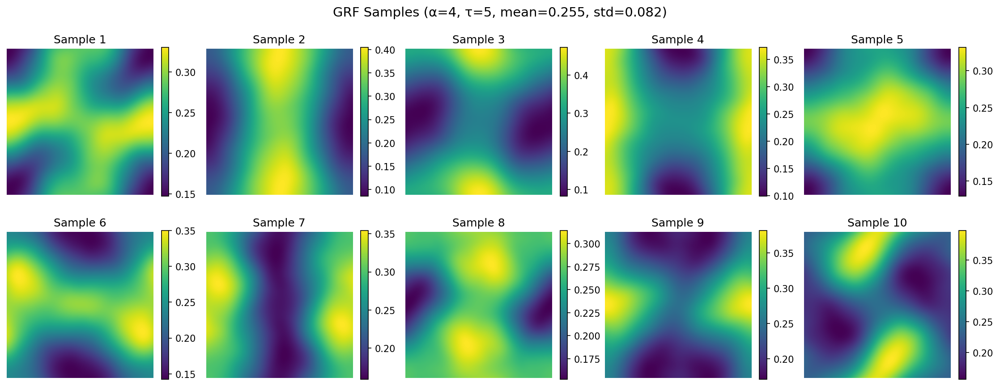
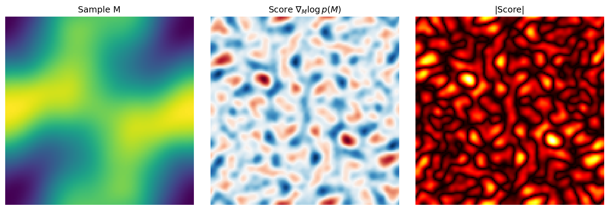
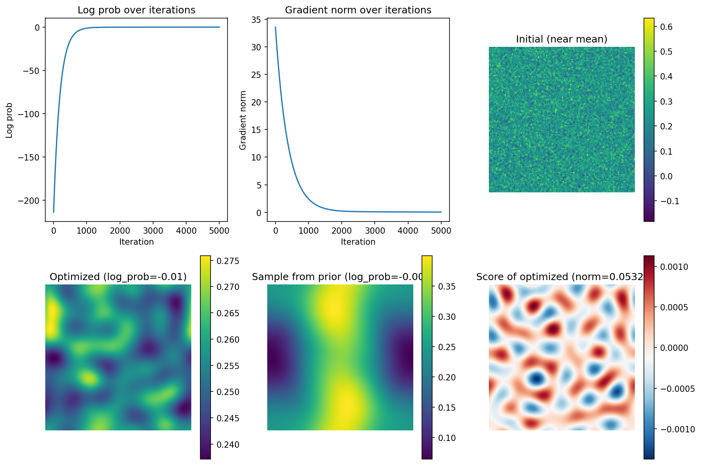

# Gaussian Random Field (GRF)

Gaussian Random Field generator with efficient score computation via FFT.

Adapted from [Devito's Darcy flow example](https://github.com/devitocodes/devito/blob/master/examples/cfd/09_Darcy_flow_equation.ipynb).

## Installation

```bash
pip install -e .
```

With visualization support:
```bash
pip install -e ".[viz]"
```

## Usage

```python
import numpy as np
from grf_with_score import GaussianRandomField

# Create a 2D GRF with values mostly in [0.01, 0.5]
grf = GaussianRandomField(dim=2, size=128, bounds=(0.01, 0.5))

# Generate samples
samples = grf.sample(10)  # shape: (10, 128, 128)

# Compute score (gradient of log probability)
score = grf.score(samples[0])

# Compute log probability
log_p = grf.log_prob(samples[0])
```

## Parameters

| Parameter | Type | Default | Description |
|-----------|------|---------|-------------|
| `dim` | int | - | Dimensionality (only 2D supported) |
| `size` | int | - | Grid size in each dimension |
| `alpha` | float | 3 | Power exponent controlling smoothness |
| `tau` | float | 5 | Scale parameter for correlation length |
| `sigma` | float | None | Internal scaling (auto-computed if None) |
| `boundary` | str | "periodic" | Boundary conditions |
| `bounds` | tuple | None | (low, high) bounds for output scaling |

## Methods

- `sample(N)` - Generate N samples from the GRF
- `score(M)` - Compute ∇_M log p(M)
- `log_prob(M)` - Compute log p(M)

## Examples

### GRF Samples


### Score Field


### Gradient Descent


## License

MIT
